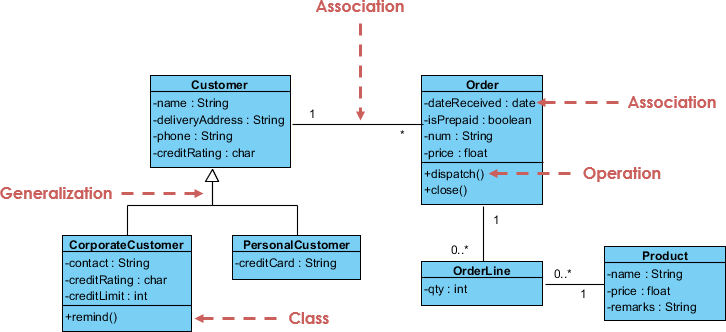
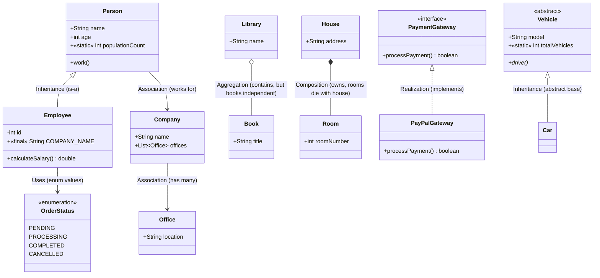

# UML Class Diagram

## What is a Class Diagram?

* A **Class Diagram** is a structural UML diagram.
* It shows **classes, attributes, methods, and relationships**.
* Acts as a **blueprint of the system**.

---

## Class Representation in UML

A class is represented as a **rectangle with three compartments**:

```
+---------------------+
| ClassName           |   ← Class Name
+---------------------+
| - attribute: Type   |   ← Attributes (fields)
| + another: Type     |
+---------------------+
| + method(): Return  |   ← Methods (operations)
+---------------------+
```

---

## Access Modifiers (Visibility)

* `+` Public
* `-` Private
* `#` Protected
* `~` Package (default)

---

## Attributes and Methods

* **Attributes**: `visibility name: Type`
* **Methods**: `visibility name(parameters): ReturnType`

### Example:

```
+name: String
-age: int
+calculateSalary(): double
```

---

## Static and Final Members

* **Static**: Attribute/Method is underlined (`populationCount`).
* **Final/Constant**: Written in ALL_CAPS (`COMPANY_NAME`).

---

## Abstract Class

* Class name in *italics*.
* Abstract methods also in *italics* or marked with `*`.

Example:

```
---------------------------------
*Vehicle*                        <<abstract>>
---------------------------------
+model: String
+drive()*                        (abstract method)
---------------------------------
```

---

## Interface

* Marked with `<<interface>>`.
* Relationship is **realization** (`dashed line with hollow triangle`).

Example:

```
<<interface>> PaymentGateway
+processPayment(): boolean
```

---

## Enumeration

* Marked with `<<enumeration>>`.
* Constants listed as attributes.

Example:

```
<<enumeration>> OrderStatus
---------------------------
PENDING
PROCESSING
COMPLETED
CANCELLED
```

---

## Relationships in UML

* **Inheritance (Generalization)**: solid line + hollow triangle

  ```
  Person ◁── Employee
  ```
* **Realization (Interface implementation)**: dashed line + hollow triangle

  ```
  PaymentGateway ◁⋯ PayPalGateway
  ```
* **Association**: solid line (optionally labeled)

  ```
  Person ─── Company   (works for)
  ```
* **Aggregation**: hollow diamond at the “whole” end

  ```
  Library ◇── Book
  ```
* **Composition**: filled diamond at the “whole” end

  ```
  House ◆── Room
  ```

---

## Example System (UML Text Format)

```
---------------------------------
Person
---------------------------------
+name: String
+age: int
+populationCount: int        {static}
+work(): void
---------------------------------

---------------------------------
Employee
---------------------------------
-id: int
+COMPANY_NAME: String        {final}
+calculateSalary(): double
---------------------------------

---------------------------------
Company
---------------------------------
+name: String
---------------------------------

---------------------------------
Office
---------------------------------
+location: String
---------------------------------

---------------------------------
Library
---------------------------------
+name: String
---------------------------------

---------------------------------
Book
---------------------------------
+title: String
---------------------------------

---------------------------------
House
---------------------------------
+address: String
---------------------------------

---------------------------------
Room
---------------------------------
+roomNumber: int
---------------------------------

---------------------------------
*Vehicle*                      <<abstract>>
---------------------------------
+model: String
+totalVehicles: int           {static}
+drive()*                     (abstract)
---------------------------------

---------------------------------
<<interface>> PaymentGateway
---------------------------------
+processPayment(): boolean
---------------------------------

---------------------------------
PayPalGateway
---------------------------------
+processPayment(): boolean
---------------------------------

---------------------------------
<<enumeration>> OrderStatus
---------------------------------
PENDING
PROCESSING
COMPLETED
CANCELLED
---------------------------------
```

### Relationships:

* `Person` ◁── `Employee` (Inheritance)
* `Person` ─── `Company` (works for)
* `Company` ─── `Office` (has many)
* `Library` ◇── `Book` (Aggregation)
* `House` ◆── `Room` (Composition)
* `Vehicle` ◁── `Car` (Inheritance from Abstract)
* `PaymentGateway` ◁⋯ `PayPalGateway` (Realization)
* `Employee` ─── `OrderStatus` (uses enum)

---

## Class Diagram Example




## Representation
A class can have name attributes and behaviour


