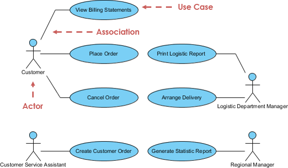

# Use Case Diagram

## Overview

A Use Case Diagram is a behavioral UML diagram that shows the functional requirements of a system. It illustrates the interactions between users (actors) and the system to achieve specific goals.

## Key Components

- **Actors**: External entities that interact with the system (users, other systems)
- **Use Cases**: Specific functionalities or services the system provides
- **Relationships**: Connections between actors and use cases
- **System Boundary**: Defines the scope of the system

## Purpose

- Capture functional requirements
- Identify system stakeholders
- Show system scope and boundaries
- Facilitate communication between stakeholders and developers

# Use Case Diagram – Key Elements

A **Use Case Diagram** is part of UML (Unified Modeling Language) that represents the **functional requirements** of a system.  
It shows **how external users (actors)** interact with the system to achieve specific goals (use cases).

---

## 1. Actors
- Represent **users** or **external systems** interacting with the system.  
- Types:  
  - **Primary Actor** – initiates interaction (e.g., Customer).  
  - **Secondary Actor** – supports the system (e.g., Payment Gateway).  
- Notation: A stick figure.  
- Example: `Customer`, `Admin`, `Bank System`.

---

## 2. Use Cases
- Represent **functionalities** or **services** the system provides to actors.  
- Always named as **verbs** or **action phrases**.  
- Notation: An oval shape.  
- Functionality or behaviour
- Example: `Place Order`, `Login`, `Generate Report`.

---

## 3. System Boundary
- Defines the **scope** of the system being modeled.  
- Represented as a **rectangle** enclosing all use cases.  
- Actors lie **outside** the system boundary.  
- It does not include any third part of external service

---

## 4. Relationships

1. **Association**  
   - A line connecting an actor to a use case.  
   - Example: `Customer ----> Place Order`

2. **Include** (<<include>>)  
   - Represents **mandatory reuse** of another use case.  
   - Example: `Place Order <<include>> Payment`

3. **Extend** (<<extend>>)  
   - Represents **optional or conditional behavior**.  
   - Example: `Login <<extend>> Two-Factor Authentication`

4. **Generalization**  
   - Used for actors or use cases.  
   - Example: `Admin <|-- SuperAdmin`

---

## 5. Use case Digram example

