# Use Case Diagram

## Overview
A **Use Case Diagram** is a **behavioral UML diagram** that shows the **functional requirements** of a system.  
It illustrates the **interactions between users (actors) and the system** to achieve specific goals.

---

## Key Components
- **Actors** → External entities that interact with the system (users, devices, or other systems).  
- **Use Cases** → Functionalities or services the system provides.  
- **Relationships** → Connections between actors and use cases.  
- **System Boundary** → Defines the scope of the system being modeled.

---

## Purpose
- Capture **functional requirements**.  
- Identify **system stakeholders**.  
- Define **system scope and boundaries**.  
- Facilitate communication between **stakeholders, analysts, and developers**.  

---

# Use Case Diagram – Key Elements

## 1. Actors
- Represent **users** or **external systems**.  
- **Types**:  
  - **Primary Actor** → Initiates the interaction (e.g., *Customer*).  
  - **Secondary Actor** → Assists the system (e.g., *Payment Gateway*).  
- **Notation**: Stick figure.  
- **Examples**: `Customer`, `Admin`, `Bank System`.

---

## 2. Use Cases
- Represent **functionalities** or **services** provided by the system.  
- Named as **verbs / action phrases**.  
- **Notation**: Oval shape.  
- **Examples**: `Login`, `Place Order`, `Generate Report`.  

---

## 3. System Boundary
- Defines the **scope of the system**.  
- Drawn as a **rectangle enclosing all use cases**.  
- **Actors remain outside** the boundary.  
- Excludes **external services** that are not part of the system.  

---

## 4. Relationships

1. **Association**  
   - Line between actor and use case.  
   - Example: `Customer ----> Place Order`

2. **Include (<<include>>)**  
   - Represents **mandatory reuse** of another use case.  
   - Example: `Place Order <<include>> Payment`

3. **Extend (<<extend>>)**  
   - Represents **optional / conditional behavior**.  
   - Example: `Login <<extend>> Two-Factor Authentication`

4. **Generalization**  
   - Used for **actors** or **use cases**.  
   - Example: `Admin <|-- SuperAdmin`

---

# ✅ Quick Summary
- **Actors** → Who is interacting with the system.  
- **Use Cases** → What they want to achieve.  
- **System Boundary** → Defines what’s inside the system.  
- **Relationships** → Association, Include, Extend, Generalization.  

---

## Example (Visual)

---

## Example (Mermaid UML)

```mermaid
flowchart TB
    %% === Actors ===
    Customer([👤 Customer])
    Admin([👤 Admin])
    PG([💳 Payment Gateway])

    %% === System Boundary ===
    subgraph System [System Boundary]
      UC1(("Place Order"))
      UC2(("Make Payment"))
      UC3(("Login"))
      UC4(("Generate Report"))
      UC5(("Two-Factor Authentication"))
    end

    %% === Associations ===
    Customer --> UC1
    Customer --> UC3
    Admin --> UC4
    PG --> UC2

    %% === Include & Extend (simulated with dashed arrows) ===
    UC1 -.-> UC2:::include
    UC3 -.-> UC5:::extend

    %% === Styles for clarity ===
    classDef include stroke-dasharray: 5 5,stroke:#2d7,stroke-width:2px;
    classDef extend stroke-dasharray: 5 5,stroke:#27f,stroke-width:2px;

```

