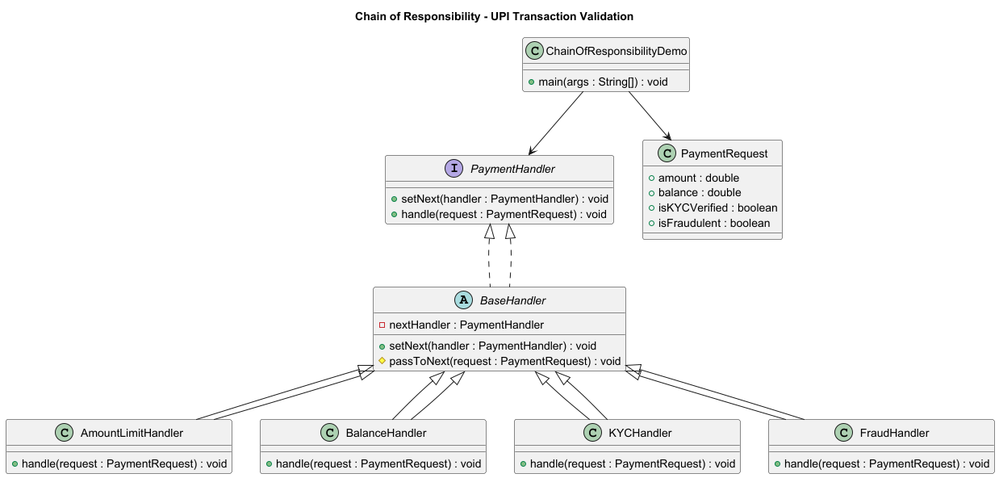

# Chain of Responsibility Design Pattern (FinTech UPI Transaction Validation)

## 💡 Concept
The **Chain of Responsibility Pattern** allows multiple handlers to process a request —  
each handler decides whether to process it or pass it to the next in the chain.

In simple terms:
> A request flows through a chain of processors until one of them handles it.

---

## 🏦 FinTech Use Case — UPI Transaction Validation

Before approving a UPI transaction, several independent checks may be needed:

1. **Amount Limit Check** → Is the transaction within UPI limits (₹1,00,000)?  
2. **Balance Check** → Does the user have enough balance?  
3. **KYC Verification** → Is the user compliant with RBI KYC rules?  
4. **Fraud Detection Check** → Is the transaction potentially fraudulent?  

Each check can approve, reject, or pass the request forward.  

---

## 📘 UML Diagram



---

## 🔹 Implementation Overview

### 1️⃣ Request Object
```java
public class PaymentRequest {
    private double amount;
    private double balance;
    private boolean isKYCVerified;
    private boolean isFraudulent;
    // getters and constructor omitted for brevity
}
```

### 2️⃣ Handler Interface
```java
public interface PaymentHandler {
    void setNext(PaymentHandler next);
    void handle(PaymentRequest request);
}
```

### 3️⃣ BaseHandler
```java
public abstract class BaseHandler implements PaymentHandler {
    protected PaymentHandler nextHandler;

    public void setNext(PaymentHandler next) {
        this.nextHandler = next;
    }

    protected void passToNext(PaymentRequest request) {
        if (nextHandler != null) nextHandler.handle(request);
        else System.out.println("✅ Transaction passed all validations successfully!");
    }
}
```

### 4️⃣ Concrete Handlers
- **AmountLimitHandler**
- **BalanceHandler**
- **KYCHandler**
- **FraudHandler**

Each one checks its specific rule and either stops or forwards the request.

### 5️⃣ Client
```java
public class ChainOfResponsibilityDemo {
    public static void main(String[] args) {
        PaymentHandler amount = new AmountLimitHandler();
        PaymentHandler balance = new BalanceHandler();
        PaymentHandler kyc = new KYCHandler();
        PaymentHandler fraud = new FraudHandler();

        amount.setNext(balance);
        balance.setNext(kyc);
        kyc.setNext(fraud);

        PaymentRequest req = new PaymentRequest(5000, 20000, true, false);
        amount.handle(req);
    }
}
```

---

## ✅ Sample Output (All Checks Passed)
```
✅ Amount check passed
✅ Balance check passed
✅ KYC verification passed
✅ Fraud check passed
✅ Transaction passed all validations successfully!
```

## ❌ Sample Output (Failure Case)
```
❌ Transaction failed: Insufficient balance
```

---

## 🧠 Why This Pattern Fits FinTech
| Rule | Description |
|------|--------------|
| **Loose Coupling** | Each validation step is independent |
| **Dynamic Chain** | You can reorder, add, or remove checks easily |
| **Open/Closed Principle** | New checks can be added without modifying others |
| **Real-world Example** | Similar to NPCI → Issuer Bank → Risk Engine flow in UPI transactions |

---

## 🧩 Difference from Decorator Pattern

| Concept | Decorator | Chain of Responsibility |
|----------|------------|--------------------------|
| **Purpose** | Adds extra behavior around the same action | Passes a request until someone handles it |
| **Flow** | All decorators execute | May stop midway |
| **Direction** | Wrapping hierarchy | Sequential pipeline |
| **FinTech Example** | Adding offers or cashback | Validating or routing payments |

---

## 🏁 Summary

The **Chain of Responsibility Pattern** helps design **transaction pipelines** where:
- Each stage validates or processes part of the request  
- The chain can evolve without modifying existing code  
- Perfect for workflows like **UPI, KYC, risk checks, or loan approval**
