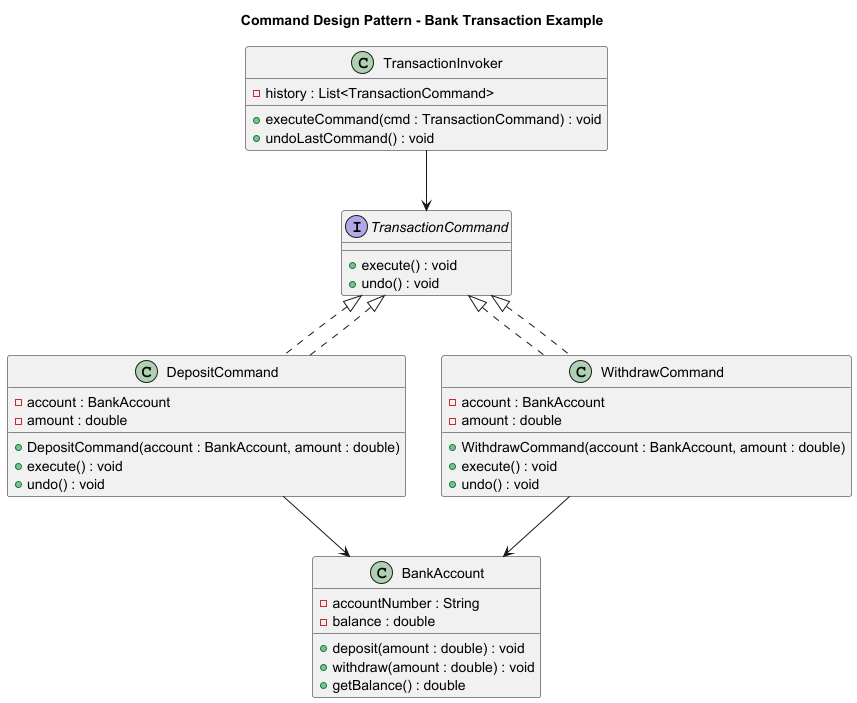

# Command Design Pattern

## 🔹 What is the Command Pattern?
The **Command Pattern** is a **behavioral design pattern** that turns a request into a **standalone object**.  
This lets you:
- Parameterize objects with requests.
- Queue or log requests.
- Support undo/redo operations.

---

## 🔹 Key Participants
1. **Command (Interface)** → declares `execute()` and `undo()`.  
2. **Concrete Commands** → implement `execute()` by calling receiver methods.  
3. **Receiver** → the object that performs the actual operation.  
4. **Invoker** → tells the command to execute, keeps history for undo.  
5. **Client** → creates commands and sets them up with receivers.  

---

## 🔹 UML Diagram


---

## 🔹 Implementation

### 1. Command Interface
```java
public interface TransactionCommand {
    void execute();
    void undo();
}
```

### 2. Receiver (Bank Account)
```java
public class BankAccount {
    private String accountNumber;
    private double balance;

    public BankAccount(String accountNumber, double balance) {
        this.accountNumber = accountNumber;
        this.balance = balance;
    }

    public void deposit(double amount) {
        balance += amount;
        System.out.println("Deposited " + amount + ", Balance: " + balance);
    }

    public void withdraw(double amount) {
        if (balance >= amount) {
            balance -= amount;
            System.out.println("Withdrew " + amount + ", Balance: " + balance);
        } else {
            System.out.println("Insufficient funds");
        }
    }
}
```

### 3. Concrete Commands
```java
public class DepositCommand implements TransactionCommand {
    private BankAccount account;
    private double amount;

    public DepositCommand(BankAccount account, double amount) {
        this.account = account;
        this.amount = amount;
    }

    public void execute() {
        account.deposit(amount);
    }

    public void undo() {
        account.withdraw(amount);
    }
}
```

```java
public class WithdrawCommand implements TransactionCommand {
    private BankAccount account;
    private double amount;

    public WithdrawCommand(BankAccount account, double amount) {
        this.account = account;
        this.amount = amount;
    }

    public void execute() {
        account.withdraw(amount);
    }

    public void undo() {
        account.deposit(amount);
    }
}
```

### 4. Invoker
```java
import java.util.Stack;

public class TransactionInvoker {
    private Stack<TransactionCommand> history = new Stack<>();

    public void executeCommand(TransactionCommand command) {
        command.execute();
        history.push(command);
    }

    public void undoLastCommand() {
        if (!history.isEmpty()) {
            TransactionCommand last = history.pop();
            last.undo();
            System.out.println("Undo last command");
        }
    }
}
```

### 5. Client
```java
public class CommandPatternDemo {
    public static void main(String[] args) {
        BankAccount account = new BankAccount("12345", 1000);
        TransactionInvoker invoker = new TransactionInvoker();

        invoker.executeCommand(new DepositCommand(account, 500));
        invoker.executeCommand(new WithdrawCommand(account, 200));

        invoker.undoLastCommand();
        invoker.undoLastCommand();
    }
}
```

---

## 🔹 Sample Output
```
Deposited 500.0, Balance: 1500.0
Withdrew 200.0, Balance: 1300.0
Deposited 200.0, Balance: 1500.0
Undo last command
Withdrew 500.0, Balance: 1000.0
Undo last command
```

---

## 🔎 When to Use Command Pattern
- Logging and auditing (transactions in fintech 🏦).  
- Supporting **undo/redo** functionality.  
- Queuing operations (batch payments).  
- Decoupling **invoker** from **receiver**.  

---

## ✅ Benefits
- Decouples **sender (client/invoker)** from **receiver (bank account)**.  
- Easy to add new commands without changing existing code.  
- Supports undo/redo functionality.  
- Commands can be queued, logged, or executed later.  
