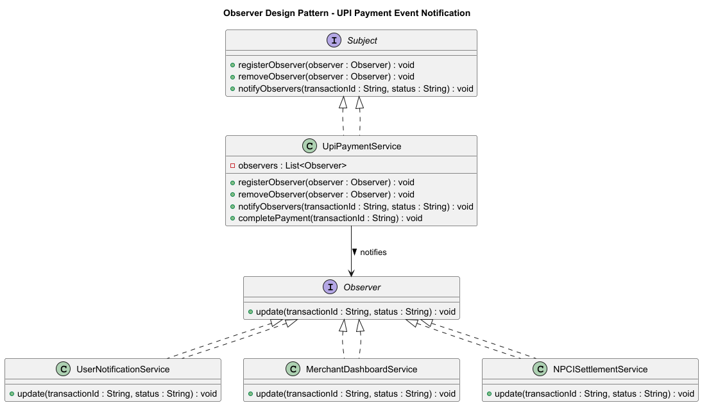

# Observer Design Pattern (FinTech UPI Payment Notification System)

## 💡 Concept
The **Observer Pattern** establishes a **one-to-many relationship** between objects —  
when one object (the **Subject**) changes state, all its dependent **Observers** are automatically notified.

In simple terms:
> “When something happens in one place (like a UPI payment), many services should get updated automatically.”

---

## 🏦 FinTech Use Case — UPI Payment Notification System

When a UPI transaction succeeds, multiple systems need to react:
1. **User Notification Service** → Sends SMS/app alert 📱  
2. **Merchant Dashboard Service** → Updates merchant transaction list 💼  
3. **NPCI Settlement Service** → Triggers backend reconciliation 🏦  

Instead of coupling these services tightly, the payment service simply **notifies** all registered observers.

---

## 📘 UML Diagram



---

## 🔹 Implementation Overview

### 1️⃣ Observer Interface
```java
public interface Observer {
    void update(String transactionId, String status);
}
```

### 2️⃣ Subject Interface
```java
public interface Subject {
    void registerObserver(Observer observer);
    void removeObserver(Observer observer);
    void notifyObservers(String transactionId, String status);
}
```

### 3️⃣ Concrete Subject
```java
public class UpiPaymentService implements Subject {
    private final List<Observer> observers = new ArrayList<>();

    public void registerObserver(Observer observer) { observers.add(observer); }
    public void removeObserver(Observer observer) { observers.remove(observer); }

    public void notifyObservers(String transactionId, String status) {
        for (Observer o : observers) o.update(transactionId, status);
    }

    public void completePayment(String transactionId) {
        System.out.println("💳 Payment successful for Transaction ID: " + transactionId);
        notifyObservers(transactionId, "SUCCESS");
    }
}
```

### 4️⃣ Concrete Observers
#### UserNotificationService
```java
public class UserNotificationService implements Observer {
    public void update(String transactionId, String status) {
        System.out.println("📱 [User Notification] Transaction " + transactionId + " status: " + status);
    }
}
```
#### MerchantDashboardService
```java
public class MerchantDashboardService implements Observer {
    public void update(String transactionId, String status) {
        System.out.println("💼 [Merchant Dashboard] Transaction " + transactionId + " updated with status: " + status);
    }
}
```
#### NPCISettlementService
```java
public class NPCISettlementService implements Observer {
    public void update(String transactionId, String status) {
        System.out.println("🏦 [NPCI Settlement] Transaction " + transactionId + " sent for settlement with status: " + status);
    }
}
```

### 5️⃣ Client
```java
public class ObserverPatternDemo {
    public static void main(String[] args) {
        UpiPaymentService upiService = new UpiPaymentService();

        upiService.registerObserver(new UserNotificationService());
        upiService.registerObserver(new MerchantDashboardService());
        upiService.registerObserver(new NPCISettlementService());

        upiService.completePayment("TXN123456789");
    }
}
```

---

## ✅ Sample Output
```
💳 Payment successful for Transaction ID: TXN123456789
📱 [User Notification] Transaction TXN123456789 status: SUCCESS
💼 [Merchant Dashboard] Transaction TXN123456789 updated with status: SUCCESS
🏦 [NPCI Settlement] Transaction TXN123456789 sent for settlement with status: SUCCESS
```

---

## 🧠 Why This Fits the Observer Pattern Perfectly

| Concept | Description |
|----------|--------------|
| **One-to-Many Relationship** | One payment event notifies multiple services |
| **Loose Coupling** | Payment service doesn’t depend on observers’ logic |
| **Dynamic Behavior** | Observers can be added or removed at runtime |
| **Event-Driven FinTech Design** | Mirrors real-world UPI payment broadcast architecture |

---

## 🏦 Real-World FinTech Examples

| Event | Observers |
|--------|------------|
| Payment Success | User App, Merchant System, NPCI, SMS Gateway |
| KYC Verified | Compliance System, User Notification |
| Loan Sanctioned | Customer Dashboard, Credit Bureau, Analytics |

---

## 🧩 Comparison with Other Patterns

| Pattern | Purpose | Execution Flow | FinTech Example |
|----------|----------|----------------|-----------------|
| **Decorator** | Add extra features to same object | All decorators execute | Apply cashback/discount dynamically |
| **Chain of Responsibility** | Pass request through validators | Stops when handled | Transaction validation chain |
| **Observer** | Notify subscribers of change | All observers notified | Payment notification fan-out |

---

## 🏁 Summary

The **Observer Pattern** is perfect for **event-driven FinTech systems** like UPI, credit scoring, or fraud alerts, where:
- One core event triggers multiple independent actions  
- Services are loosely coupled and easily extendable  
- Behavior can change at runtime without modifying core payment logic
