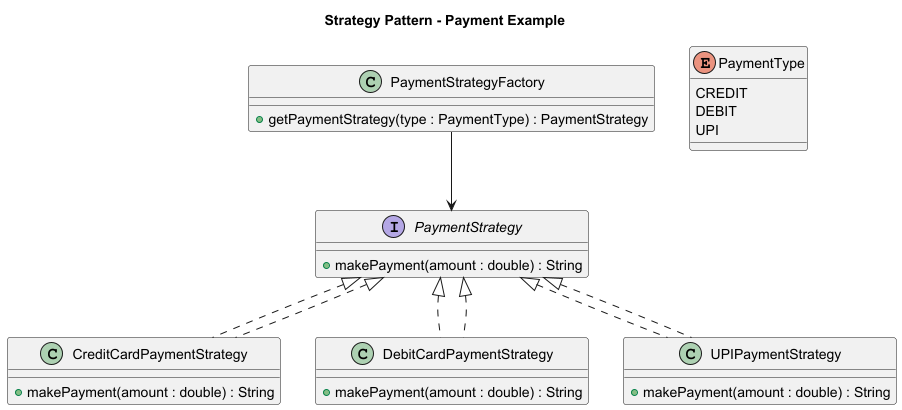

# Strategy Design Pattern in Java

The **Strategy Pattern** defines a family of algorithms, encapsulates each one, and makes them interchangeable.  
It allows the algorithm (strategy) to vary independently from clients that use it.

In this example, we implement different **payment strategies** (`CreditCard`, `DebitCard`, `UPI`) that share a common interface.

---

## 📘 UML Diagram



---

## 🔹 Strategy Interface

```java
package com.learning.patterns.strategy;

/*
 * Strategy Interface
 * - Defines the common contract for all payment strategies.
 * - Each payment method must implement this interface.
 */
public interface PaymentStrategy {
    String makePayment(double amount);
}
```

---

## 🔹 Concrete Strategies

```java
package com.learning.patterns.strategy;

import java.util.UUID;

/*
 * Concrete Strategy: Credit Card Payment
 */
public class CreditCardPaymentStrategy implements PaymentStrategy {
    @Override
    public String makePayment(double amount) {
        IO.println("Making credit card payment of amount: " + amount);
        return UUID.randomUUID().toString(); // Simulate transaction ID
    }
}
```

```java
package com.learning.patterns.strategy;

import java.util.UUID;

/*
 * Concrete Strategy: Debit Card Payment
 */
public class DebitCardPaymentStrategy implements PaymentStrategy {
    @Override
    public String makePayment(double amount) {
        IO.println("Making debit card payment of amount: " + amount);
        return UUID.randomUUID().toString();
    }
}
```

```java
package com.learning.patterns.strategy;

import java.util.UUID;

/*
 * Concrete Strategy: UPI Payment
 */
public class UPIPaymentStrategy implements PaymentStrategy {
    @Override
    public String makePayment(double amount) {
        IO.println("Making UPI payment of amount: " + amount);
        return UUID.randomUUID().toString();
    }
}
```

---

## 🔹 Enum for Payment Types

```java
package com.learning.patterns.strategy;

/*
 * Enum to represent supported payment types.
 */
public enum PaymentType {
    CREDIT,
    DEBIT,
    UPI
}
```

---

## 🔹 Strategy Factory

```java
package com.learning.patterns.strategy;

/*
 * Factory class for returning the appropriate PaymentStrategy
 * based on the given PaymentType.
 */
public class PaymentStrategyFactory {

    public static PaymentStrategy getPaymentStrategy(PaymentType paymentType) {
        switch (paymentType) {
            case CREDIT:
                return new CreditCardPaymentStrategy();
            case DEBIT:
                return new DebitCardPaymentStrategy();
            case UPI:
                return new UPIPaymentStrategy();
            default:
                throw new IllegalArgumentException("Unknown payment type: " + paymentType);
        }
    }
}
```

---

## 🔹 Client Code (Usage)

```java
public class StrategyPatternDemo {
    public static void main(String[] args) {
        // Select payment strategy dynamically
        PaymentStrategy strategy = PaymentStrategyFactory.getPaymentStrategy(PaymentType.UPI);

        // Execute payment
        String txnId = strategy.makePayment(5000);
        System.out.println("Transaction successful with ID: " + txnId);
    }
}
```

---

## 🔎 When to Use Strategy Pattern

- When you have multiple algorithms (behaviors) for a task, and you want to switch between them at runtime.
- To eliminate long `if-else` or `switch` blocks by delegating behavior to strategy classes.
- When related classes differ only in their behavior.

---

## ✅ Benefits

- Open/Closed Principle: You can add new strategies without changing existing code.
- Cleaner code by avoiding large conditional statements.
- Promotes code reusability and flexibility.

---

## ⚠ Considerations

- Adds complexity with additional classes.
- Client must be aware of different strategies.

---

## UML Diagram (Conceptual)

```
+-------------------+         +-----------------------------+
|   PaymentStrategy |<>------>| CreditCardPaymentStrategy   |
|  <<interface>>    |         | DebitCardPaymentStrategy    |
| + makePayment()   |         | UPIPaymentStrategy          |
+-------------------+         +-----------------------------+

               ^
               |
+---------------------------+
| PaymentStrategyFactory    |
| + getPaymentStrategy()    |
+---------------------------+
               |
               v
       +-----------------+
       |   Client        |
       +-----------------+
```

---

## ✅ Summary

The **Strategy Pattern** lets you define a family of algorithms (payment methods), encapsulate them, and make them interchangeable at runtime.  
In this example, `PaymentStrategy` is the interface, and each payment method (`CreditCard`, `DebitCard`, `UPI`) is a concrete strategy.  
The client chooses which one to use at runtime via `PaymentStrategyFactory`.

