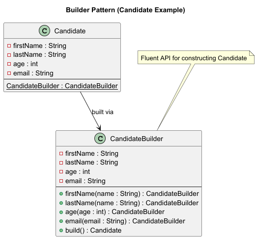

# Builder Pattern Variations in Java

This document demonstrates different ways to implement the **Builder Design Pattern** in Java, using a `Candidate` class as an example.

---

## UML diagram


---

## 1. Classic Nested Static Builder

```java
public class Candidate {
    private final String name;
    private final int age;
    private final String email;

    private Candidate(CandidateBuilder builder) {
        this.name = builder.name;
        this.age = builder.age;
        this.email = builder.email;
    }

    public static class CandidateBuilder {
        private String name;
        private int age;
        private String email;

        public CandidateBuilder name(String name) { this.name = name; return this; }
        public CandidateBuilder age(int age) { this.age = age; return this; }
        public CandidateBuilder email(String email) { this.email = email; return this; }

        public Candidate build() { return new Candidate(this); }
    }
}
```

Usage:
```java
Candidate c = new Candidate.CandidateBuilder()
                    .name("John")
                    .age(30)
                    .email("john@example.com")
                    .build();
```

---

## 2. Telescoping Constructor (Pre-Builder)

```java
public class Candidate {
    private final String name;
    private final int age;
    private final String email;

    public Candidate(String name, int age, String email) {
        this.name = name;
        this.age = age;
        this.email = email;
    }
}
```

Usage:
```java
Candidate c = new Candidate("John", 30, "john@example.com");
```

---

## 3. Java Records + Builder (Java 16+)

```java
public record Candidate(String name, int age, String email) {
    public static class Builder {
        private String name;
        private int age;
        private String email;

        public Builder name(String name) { this.name = name; return this; }
        public Builder age(int age) { this.age = age; return this; }
        public Builder email(String email) { this.email = email; return this; }

        public Candidate build() { return new Candidate(name, age, email); }
    }
}
```

Usage:
```java
Candidate c = new Candidate.Builder()
                    .name("John")
                    .age(30)
                    .email("john@example.com")
                    .build();
```

---

## 4. Lombok @Builder

```java
import lombok.Builder;
import lombok.ToString;

@Builder
@ToString
public class Candidate {
    private String name;
    private int age;
    private String email;
}
```

Usage:
```java
Candidate c = Candidate.builder()
                       .name("John")
                       .age(30)
                       .email("john@example.com")
                       .build();
```

---

## 5. Step Builder Pattern (Fluent + Enforced Order)

```java
public class Candidate {
    private final String name;
    private final int age;
    private final String email;

    private Candidate(Builder builder) {
        this.name = builder.name;
        this.age = builder.age;
        this.email = builder.email;
    }

    // Step interfaces
    public interface NameStep { AgeStep name(String name); }
    public interface AgeStep { EmailStep age(int age); }
    public interface EmailStep { BuildStep email(String email); }
    public interface BuildStep { Candidate build(); }

    // Implementation
    public static class Builder implements NameStep, AgeStep, EmailStep, BuildStep {
        private String name;
        private int age;
        private String email;

        public AgeStep name(String name) { this.name = name; return this; }
        public EmailStep age(int age) { this.age = age; return this; }
        public BuildStep email(String email) { this.email = email; return this; }

        public Candidate build() { return new Candidate(this); }
    }

    public static NameStep builder() { return new Builder(); }
}
```

Usage:
```java
Candidate c = Candidate.builder()
                       .name("John")
                       .age(30)
                       .email("john@example.com")
                       .build();
```

---

## 6. Functional Builder (Java 8+ with Lambdas)

```java
import java.util.function.Consumer;

public class Candidate {
    private String name;
    private int age;
    private String email;

    private Candidate() {}

    public static Candidate build(Consumer<Candidate> builder) {
        Candidate c = new Candidate();
        builder.accept(c);
        return c;
    }

    // setters for lambdas
    public void setName(String name) { this.name = name; }
    public void setAge(int age) { this.age = age; }
    public void setEmail(String email) { this.email = email; }
}
```

Usage:
```java
Candidate c = Candidate.build(cand -> {
    cand.setName("John");
    cand.setAge(30);
    cand.setEmail("john@example.com");
});
```

---

# 🔎 Comparison of Builder Variations

| Builder Type             | Pros | Cons | Best Use Case |
|---------------------------|------|------|---------------|
| Classic Nested Builder    | Standard, flexible | Verbose | General purpose |
| Telescoping Constructor   | Simple | Not scalable | Few fields |
| Records + Builder         | Immutable, modern | Java 16+ | Modern apps |
| Lombok @Builder           | Super clean | Needs Lombok | Enterprise apps |
| Step Builder              | Enforces order | Verbose | Strict API design |
| Functional Builder        | Concise, flexible | Mutable | DSL-like configs |

---
