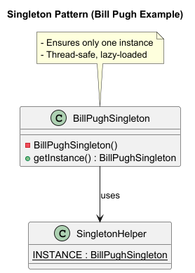

# Singleton Pattern in Java

The **Singleton Pattern** ensures that only **one instance** of a class exists in the JVM and provides a global access point to it.  

This file contains **all major implementations** of Singleton in Java.

---

## UML diagram


---

## 1. Basic Singleton (Not Thread-Safe)
```java
/*
 * Basic Singleton with no thread safety
 * - Simple but not thread-safe.
 * - Multiple threads may create multiple instances.
 */
@SuppressWarnings("java:S1118")
public class BasicSingleton {
    private static BasicSingleton instance;

    private BasicSingleton() {}

    public static BasicSingleton getInstance() {
        if (instance == null) {
            instance = new BasicSingleton();
        }
        return instance;
    }
}
```

---

## 2. Lazy Singleton (Non-Thread Safe)
```java
/*
 * Lazy Singleton (not thread-safe)
 * - Instance is created only when needed.
 * - Multiple threads may still create multiple instances.
 */
public class LazySingleton {
    private static LazySingleton instance;

    private LazySingleton() {}

    public static LazySingleton getInstance() {
        if (instance == null) {
            instance = new LazySingleton();
        }
        return instance;
    }
}
```

---

## 3. Synchronized Method Singleton
```java
/*
 * Thread-Safe Singleton using synchronized method
 * - Simple but slow due to synchronization on every call.
 */
public class SynchronizedSingleton {
    private static SynchronizedSingleton instance;

    private SynchronizedSingleton() {}

    public static synchronized SynchronizedSingleton getInstance() {
        if (instance == null) {
            instance = new SynchronizedSingleton();
        }
        return instance;
    }
}
```

---

## 4. Eager Initialization Singleton
```java
/*
 * Eager Initialization Singleton
 * - Instance is created at class loading time.
 * - Thread-safe but not lazy (wastes memory if unused).
 */
public class EagerSingleton {
    private static final EagerSingleton INSTANCE = new EagerSingleton();

    private EagerSingleton() {}

    public static EagerSingleton getInstance() {
        return INSTANCE;
    }
}
```

---

## 5. Static Block Initialization Singleton
```java
/*
 * Static Block Initialization Singleton
 * - Similar to Eager Initialization, but allows exception handling.
 */
public class StaticBlockSingleton {
    private static final StaticBlockSingleton INSTANCE;

    static {
        try {
            INSTANCE = new StaticBlockSingleton();
        } catch (Exception e) {
            throw new RuntimeException("Error during instance creation", e);
        }
    }

    private StaticBlockSingleton() {}

    public static StaticBlockSingleton getInstance() {
        return INSTANCE;
    }
}
```

---

## 6. Thread-Safe Singleton (Double-Checked Locking)
```java
/*
 * Thread-Safe Singleton using Double-Checked Locking
 * - Uses volatile to prevent instruction reordering.
 * - Synchronization happens only during first initialization.
 */
public class ThreadSafeSingleton {
    private static volatile ThreadSafeSingleton instance;

    private ThreadSafeSingleton() {}

    public static ThreadSafeSingleton getInstance() {
        if (instance == null) {
            synchronized (ThreadSafeSingleton.class) {
                if (instance == null) {
                    instance = new ThreadSafeSingleton();
                }
            }
        }
        return instance;
    }
}
```

---

## 7. Bill Pugh Singleton (Static Inner Class)
```java
/*
 * Bill Pugh Singleton
 * - Lazy initialization with static inner class.
 * - Thread-safe without synchronization overhead.
 */
public class BillPughSingleton {
    private BillPughSingleton() {}

    private static class SingletonHelper {
        private static final BillPughSingleton INSTANCE = new BillPughSingleton();
    }

    public static BillPughSingleton getInstance() {
        return SingletonHelper.INSTANCE;
    }
}
```

---

## 8. Enum Singleton
```java
/*
 * Enum Singleton (Best Practice)
 * - Simplest and safest implementation.
 * - Handles serialization and reflection automatically.
 * - Thread-safe by default.
 */
public enum EnumSingleton {
    INSTANCE;

    public void doSomething() {
        System.out.println("Singleton method executed!");
    }
}
```

---
# 🔎 Comparison of Implementations

| Approach                 | Lazy? | Thread-Safe? | Performance | Notes |
|--------------------------|-------|--------------|-------------|-------|
| Basic Singleton          | ✅    | ❌            | ✅           | Only for single-threaded apps |
| Lazy (non-thread safe)   | ✅    | ❌            | ✅           | Simple but unsafe |
| Synchronized Method      | ✅    | ✅            | ❌           | Locks every call |
| Eager Initialization     | ❌    | ✅            | ✅           | Wastes memory if unused |
| Static Block             | ❌    | ✅            | ✅           | Allows exception handling |
| Double-Checked Locking   | ✅    | ✅            | ✅           | Efficient, commonly used |
| Bill Pugh (Inner Class)  | ✅    | ✅            | ✅           | Clean & efficient |
| Enum Singleton           | ✅    | ✅            | ✅           | Best practice, reflection & serialization safe |

---

📌 **Recommendations:**
- Use **Enum Singleton** if you don’t need lazy loading and want maximum safety.  
- Use **Bill Pugh Singleton** if you prefer lazy initialization with clean code.  
