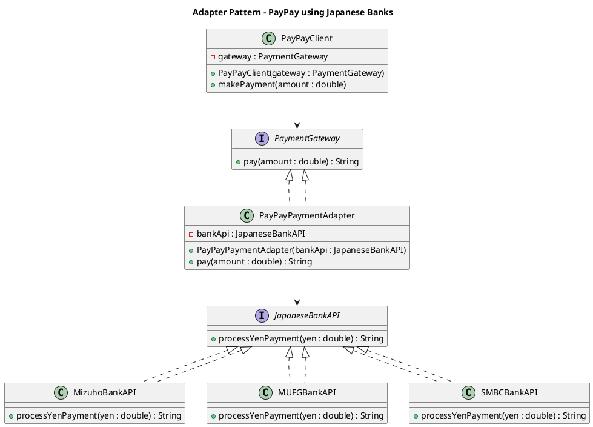

# Adapter Design Pattern

The **Adapter Pattern** converts the interface of a class into another interface that clients expect.  
It allows classes with incompatible interfaces to work together.

---

## 🔹 Problem
- **PayPay Card** wants to process payments through **Japanese banks** (Mizuho, MUFG, SMBC).  
- Each bank exposes its **own API** (different method signature).  
- PayPay system expects a **unified interface** to handle payments.  

---

## 🔹 Solution: Adapter Pattern
- Define a common interface `PaymentGateway` (expected by PayPay).  
- Keep bank-specific APIs (`JapaneseBankAPI`) as Adaptees.  
- Use `PayPayPaymentAdapter` to **translate** between the two.  

---

## 🔹 Class Diagram (UML)



---

## 🔹 Implementation

### Target Interface (what PayPay expects)
```java
public interface PaymentGateway {
    String pay(double amount);
}
```

### Adaptee Interface (Bank APIs)
```java
public interface JapaneseBankAPI {
    String processYenPayment(double yen);
}
```

### Concrete Adaptees (Banks)
```java
public class MizuhoBankAPI implements JapaneseBankAPI {
    public String processYenPayment(double yen) {
        return "Mizuho Bank processed payment of " + yen + " JPY";
    }
}
```

```java
public class MUFGBankAPI implements JapaneseBankAPI {
    public String processYenPayment(double yen) {
        return "MUFG Bank processed payment of " + yen + " JPY";
    }
}
```

```java
public class SMBCBankAPI implements JapaneseBankAPI {
    public String processYenPayment(double yen) {
        return "SMBC Bank processed payment of " + yen + " JPY";
    }
}
```

### Adapter (Bridge between PayPay & Banks)
```java
public class PayPayPaymentAdapter implements PaymentGateway {
    private JapaneseBankAPI bankApi;

    public PayPayPaymentAdapter(JapaneseBankAPI bankApi) {
        this.bankApi = bankApi;
    }

    @Override
    public String pay(double amount) {
        return bankApi.processYenPayment(amount);
    }
}
```

### Client (PayPay)
```java
public class PayPayClient {
    private PaymentGateway gateway;

    public PayPayClient(PaymentGateway gateway) {
        this.gateway = gateway;
    }

    public void makePayment(double amount) {
        String result = gateway.pay(amount);
        System.out.println("PayPay: " + result);
    }

    public static void main(String[] args) {
        PaymentGateway mizuhoAdapter = new PayPayPaymentAdapter(new MizuhoBankAPI());
        PayPayClient client1 = new PayPayClient(mizuhoAdapter);
        client1.makePayment(10000);

        PaymentGateway mufgAdapter = new PayPayPaymentAdapter(new MUFGBankAPI());
        PayPayClient client2 = new PayPayClient(mufgAdapter);
        client2.makePayment(20000);

        PaymentGateway smbcAdapter = new PayPayPaymentAdapter(new SMBCBankAPI());
        PayPayClient client3 = new PayPayClient(smbcAdapter);
        client3.makePayment(30000);
    }
}
```

---

## 🔹 Output
```
PayPay: Mizuho Bank processed payment of 10000.0 JPY
PayPay: MUFG Bank processed payment of 20000.0 JPY
PayPay: SMBC Bank processed payment of 30000.0 JPY
```

---

## 🔎 Key Points
- **Target (`PaymentGateway`)** → Unified interface for PayPay.  
- **Adaptee (`JapaneseBankAPI`)** → Bank APIs with different signatures.  
- **Adapter (`PayPayPaymentAdapter`)** → Translates PayPay requests into Bank API calls.  
- **Client (`PayPayClient`)** → Uses unified interface without worrying about bank differences.  

---

## ✅ Summary
The **Adapter Pattern** helps integrate **third-party or legacy systems** with your own system by providing a bridge.  
In this fintech example, **PayPay can integrate multiple Japanese banks seamlessly** without changing its own business logic.

