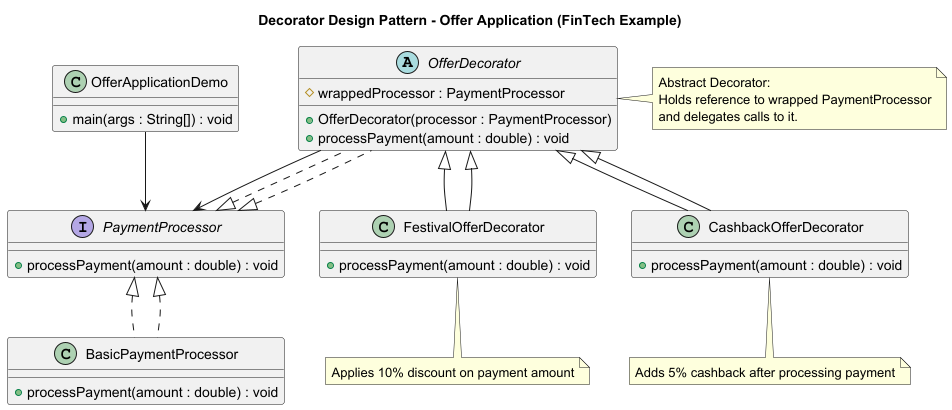

# Decorator Design Pattern

## 💡 Concept
The **Decorator Pattern** allows you to **add new features or behaviors** to an existing object **dynamically**,  
without changing its core logic or class structure.

In simple words — you “wrap” a basic object with layers of decorators that add extra functionality.

---

## 🏦 FinTech Example — Offer Application
In a payment system, you might have a **base payment processor** that handles payments.  
Sometimes, you want to **add offers like discounts or cashback** depending on the user or campaign.

These offers are **optional and change frequently**, so using the **Decorator Pattern** makes sense.

---

## 🧩 Structure in This Example

| Component | Description |
|------------|--------------|
| `PaymentProcessor` | The base interface for all payment processors |
| `BasicPaymentProcessor` | The core processor handling normal payments |
| `OfferDecorator` | Abstract decorator that wraps any `PaymentProcessor` |
| `FestivalOfferDecorator` | Adds a 10% festival discount |
| `CashbackOfferDecorator` | Adds a 5% cashback benefit |
| `OfferApplicationDemo` | Client that dynamically composes decorators |

---

## 📘 UML Diagram


---

## 🔹 Code Example

### 1️⃣ `PaymentProcessor.java`
```java
public interface PaymentProcessor {
    void processPayment(double amount);
}
```

### 2️⃣ `BasicPaymentProcessor.java`
```java
public class BasicPaymentProcessor implements PaymentProcessor {
    @Override
    public void processPayment(double amount) {
        System.out.println("Processing base payment of ₹" + amount);
    }
}
```

### 3️⃣ `OfferDecorator.java`
```java
public abstract class OfferDecorator implements PaymentProcessor {
    protected PaymentProcessor wrappedProcessor;

    public OfferDecorator(PaymentProcessor processor) {
        this.wrappedProcessor = processor;
    }

    @Override
    public void processPayment(double amount) {
        wrappedProcessor.processPayment(amount);
    }
}
```

### 4️⃣ `FestivalOfferDecorator.java`
```java
public class FestivalOfferDecorator extends OfferDecorator {
    public FestivalOfferDecorator(PaymentProcessor processor) {
        super(processor);
    }

    @Override
    public void processPayment(double amount) {
        double discounted = amount * 0.9; // 10% off
        System.out.println("[Festival Offer] 10% discount applied! New amount: ₹" + discounted);
        super.processPayment(discounted);
    }
}
```

### 5️⃣ `CashbackOfferDecorator.java`
```java
public class CashbackOfferDecorator extends OfferDecorator {
    public CashbackOfferDecorator(PaymentProcessor processor) {
        super(processor);
    }

    @Override
    public void processPayment(double amount) {
        super.processPayment(amount);
        double cashback = amount * 0.05;
        System.out.println("[Cashback Offer] ₹" + cashback + " cashback will be credited!");
    }
}
```

### 6️⃣ `OfferApplicationDemo.java`
```java
public class OfferApplicationDemo {
    public static void main(String[] args) {
        PaymentProcessor processor = new BasicPaymentProcessor();

        // Apply Festival offer + Cashback offer dynamically
        processor = new CashbackOfferDecorator(
                        new FestivalOfferDecorator(processor));

        processor.processPayment(2000);
    }
}
```

---

## 🧾 Output
```
[Festival Offer] 10% discount applied! New amount: ₹1800.0
Processing base payment of ₹1800.0
[Cashback Offer] ₹90.0 cashback will be credited!
```

---

## 🔍 Why This Makes Sense in FinTech
| Reason | Explanation |
|--------|--------------|
| **Offers are optional** | You can apply or skip decorators at runtime |
| **Dynamic Composition** | Combine multiple offers (discount + cashback) |
| **Extensible** | Add new offer types (tax, surcharge, loyalty points) easily |
| **Open/Closed Principle** | Existing classes remain unchanged |

---

## 🧠 Simple Analogy
Think of a **pizza order**:  
You start with a plain pizza (base payment), then add toppings (offers).  
Each topping adds flavor (behavior) without changing the original pizza.

---

## ✅ Summary
- The **Decorator Pattern** helps you wrap and extend functionality dynamically.  
- Perfect for **optional, runtime behaviors** like **offers, taxes, surcharges** in payments.  
- Keeps your base payment system clean, simple, and easily extensible.

