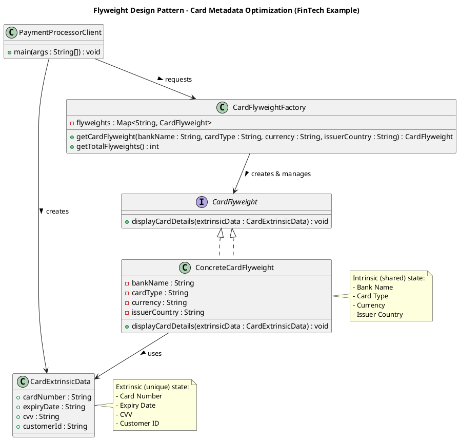

# Flyweight Design Pattern (FinTech Card Metadata Optimization)

## 💡 Concept
The **Flyweight Pattern** is a **structural design pattern** used to minimize memory usage by sharing common data (intrinsic state) among multiple similar objects.

Instead of creating new instances for every object, shared data is stored centrally and reused — reducing memory overhead when many objects share identical properties.

---

## 🏦 FinTech Use Case — Card Metadata Optimization

In a payment system, every transaction involves a `Card` object.  
Each card may have:
- **Shared attributes** (Intrinsic): Bank Name, Card Type, Currency, Issuer Country  
- **Unique attributes** (Extrinsic): Card Number, Expiry Date, CVV, Customer ID  

Creating separate card objects for millions of transactions leads to **huge memory waste**.  
The **Flyweight Pattern** allows us to **reuse shared card metadata** across transactions.

---

## 📘 UML Diagram



---

## 🔹 Implementation Overview

### 1️⃣ Flyweight Interface
```java
public interface CardFlyweight {
    void displayCardDetails(CardExtrinsicData extrinsicData);
}
```

### 2️⃣ Concrete Flyweight
```java
public class ConcreteCardFlyweight implements CardFlyweight {
    private final String bankName;
    private final String cardType;
    private final String currency;
    private final String issuerCountry;

    public ConcreteCardFlyweight(String bankName, String cardType, String currency, String issuerCountry) {
        this.bankName = bankName;
        this.cardType = cardType;
        this.currency = currency;
        this.issuerCountry = issuerCountry;
    }

    @Override
    public void displayCardDetails(CardExtrinsicData extrinsicData) {
        System.out.println("----- Card Transaction Details -----");
        System.out.println("Bank Name     : " + bankName);
        System.out.println("Card Type     : " + cardType);
        System.out.println("Currency      : " + currency);
        System.out.println("Issuer Country: " + issuerCountry);
        System.out.println("Card Number   : " + extrinsicData.getCardNumber());
        System.out.println("Expiry Date   : " + extrinsicData.getExpiryDate());
        System.out.println("Customer ID   : " + extrinsicData.getCustomerId());
        System.out.println("------------------------------------\n");
    }
}
```

### 3️⃣ Extrinsic Data Class
```java
public class CardExtrinsicData {
    private final String cardNumber;
    private final String expiryDate;
    private final String cvv;
    private final String customerId;

    public CardExtrinsicData(String cardNumber, String expiryDate, String cvv, String customerId) {
        this.cardNumber = cardNumber;
        this.expiryDate = expiryDate;
        this.cvv = cvv;
        this.customerId = customerId;
    }

    // Getters
    public String getCardNumber() { return cardNumber; }
    public String getExpiryDate() { return expiryDate; }
    public String getCvv() { return cvv; }
    public String getCustomerId() { return customerId; }
}
```

### 4️⃣ Flyweight Factory
```java
public class CardFlyweightFactory {
    private static final Map<String, CardFlyweight> flyweights = new HashMap<>();

    public static CardFlyweight getCardFlyweight(String bankName, String cardType, String currency, String issuerCountry) {
        String key = bankName + "-" + cardType + "-" + currency + "-" + issuerCountry;
        CardFlyweight flyweight = flyweights.get(key);

        if (flyweight == null) {
            flyweight = new ConcreteCardFlyweight(bankName, cardType, currency, issuerCountry);
            flyweights.put(key, flyweight);
            System.out.println("🆕 Creating new Flyweight for key: " + key);
        } else {
            System.out.println("♻️ Reusing existing Flyweight for key: " + key);
        }

        return flyweight;
    }

    public static int getTotalFlyweights() {
        return flyweights.size();
    }
}
```

### 5️⃣ Client
```java
public class FlyweightPatternDemo {
    public static void main(String[] args) {
        System.out.println("===== Flyweight Pattern - FinTech Card Metadata Example =====\n");

        CardFlyweight card1 = CardFlyweightFactory.getCardFlyweight("HDFC Bank", "VISA", "INR", "India");
        CardFlyweight card2 = CardFlyweightFactory.getCardFlyweight("HDFC Bank", "VISA", "INR", "India");
        CardFlyweight card3 = CardFlyweightFactory.getCardFlyweight("ICICI Bank", "MasterCard", "INR", "India");

        CardExtrinsicData txn1 = new CardExtrinsicData("4111111111111111", "12/26", "123", "CUST001");
        CardExtrinsicData txn2 = new CardExtrinsicData("4222222222222222", "10/25", "456", "CUST002");
        CardExtrinsicData txn3 = new CardExtrinsicData("4333333333333333", "11/27", "789", "CUST003");

        card1.displayCardDetails(txn1);
        card2.displayCardDetails(txn2);
        card3.displayCardDetails(txn3);

        System.out.println("Total Flyweight objects created: " + CardFlyweightFactory.getTotalFlyweights());
    }
}
```

---

## ✅ Output Example

```
🆕 Creating new Flyweight for key: HDFC Bank-VISA-INR-India
♻️ Reusing existing Flyweight for key: HDFC Bank-VISA-INR-India
🆕 Creating new Flyweight for key: ICICI Bank-MasterCard-INR-India

----- Card Transaction Details -----
Bank Name     : HDFC Bank
Card Type     : VISA
Currency      : INR
Issuer Country: India
Card Number   : 4111111111111111
Expiry Date   : 12/26
Customer ID   : CUST001
------------------------------------

Total Flyweight objects created: 2
```

---

## 🧠 Why Flyweight Fits FinTech Use Cases

| Feature | Description |
|----------|--------------|
| **Memory Optimization** | Reuses shared metadata across millions of cards |
| **Shared Intrinsic Data** | Bank name, card type, currency |
| **Unique Extrinsic Data** | Card number, expiry, customer info |
| **Real-World Fit** | Payment gateway metadata caching, card brand info reuse |

---

## 🏦 Real-World FinTech Examples

| Use Case | Intrinsic Data (Shared) | Extrinsic Data (Unique) |
|-----------|-------------------------|--------------------------|
| Card Metadata | Bank, Brand, Currency | Card Number, Expiry |
| Loan Templates | Interest Rate Policy | Borrower Details |
| Currency Info | Symbol, Country | Exchange Rate |
| KYC Templates | Document Type | Customer ID |

---

## 🏁 Summary

The **Flyweight Pattern** is ideal for FinTech systems handling **massive, repetitive data** — like card details, bank metadata, or loan templates.

It ensures:
- **Reduced memory footprint**
- **Improved scalability**
- **Better object reuse**
